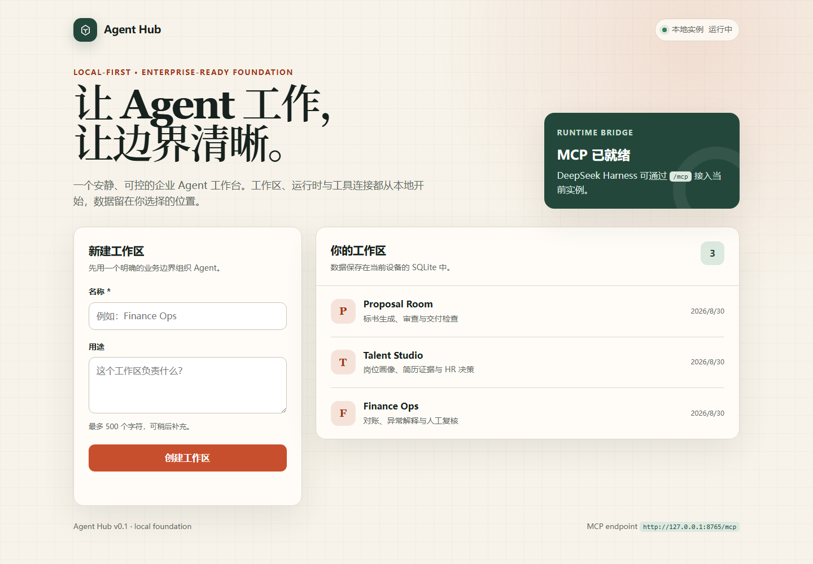

# Agent Hub

[](LICENSE)
[](https://www.python.org/)
[](https://docs.astral.sh/uv/)
[](https://modelcontextprotocol.io/)

Local-first, enterprise Agent platform powered by DeepSeek Harness. Agent Hub is a small, honest control plane: it proves the deployment shape and the connection boundary before adding orchestration.

> 当前状态：本地基础版，非生产多租户服务。详见「当前边界」。



## 它解决什么

把「本地跑起来一个能给企业 Agent 用的工作区」这件事，做成一条命令可启动、有真实界面、有 MCP 接入边的可运行边界。第一版故意很小——先把「能运行、能验证、能引用」做实，再往上叠编排。

## 特性

- **本地优先**：Python 控制面 + 浏览器 UI + SQLite 存储，数据默认就在本地。
- **原生 MCP 面**：通过 `http://127.0.0.1:8765/mcp` 暴露工具，供 Harness 运行时接入。
- **一条命令启动**：`uv run agent-hub`，首次运行自动创建环境并安装锁定依赖。
- **边界清晰**：默认只绑定 `127.0.0.1`，未显式允许前拒绝远程绑定，无鉴权、非多租户。

## 运行（本地）

前置：Python 3.11+ 与 [uv](https://docs.astral.sh/uv/)。

```bash
# macOS / Linux
uv run agent-hub
```

```powershell
# Windows
uv run agent-hub
```

`uv` 会在首次运行创建环境并安装锁定依赖。打开 <http://127.0.0.1:8765>；本地数据默认存于：

- macOS / Linux：`~/.agent-hub/agent-hub.db`
- Windows：`%USERPROFILE%\.agent-hub\agent-hub.db`

## 接入 DeepSeek Harness

把 [`examples/dsh.cordis.yml`](examples/dsh.cordis.yml) 加到你的 DSH profile，然后**先启动 Agent Hub，再启动 Harness 运行时**。MCP 端点：

```text
http://127.0.0.1:8765/mcp
```

当前暴露的 MCP 工具：

| 工具 | 作用 |
| --- | --- |
| `agenthub_status` | 查询整体状态 |
| `workspace_list` | 列出工作区 |
| `workspace_create` | 创建工作区 |

## 当前边界

这是本地基础，不是生产多租户服务：默认绑定 `127.0.0.1`，无鉴权。除非显式设置 `AGENT_HUB_ALLOW_REMOTE=1`，否则拒绝远程绑定。

之前的 Java 原型与历史已归档清理。编排与多租户能力在后续计划中。

## 检查

```bash
uv run python -m unittest discover -s tests -v
```

## 许可

MIT © Chris

## 相关

- [DSH IM](https://github.com/onlyforchris/dsh-im) — 多端 IM 接入
- [DSH Timer Agent](https://github.com/onlyforchris/dsh-timer-agent) — 定时调度
